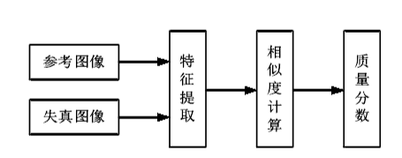
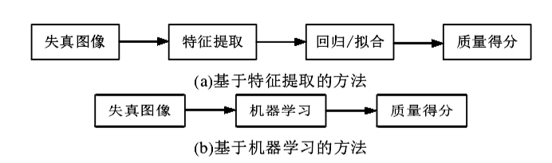

除了对仿真系统的评价进行研究之外,还有学者对仿真图像的图像质量进行了相应的研究,并且采用了可见光常用的图像质量评价理论体系。目前,图像质量评价主要使用的方法分为两大类,一种是有人类视觉参与的主观质量评价,另一种是直接计算图像特征的客观质量评价[ 58]。主观质量评价主要是指直接对图像进行评价,通过人眼观察比较,并且按照之前获得的经验对图像进行直观的判断评价,从而得到符合人类主观认知的质量评价值。通常情况下,这是最准确的方法,但是使用这种方法往往需要消耗人力、物力、财力,而且容易受到评分者的主观意识和环境影响。根据有无参考图像,客观质量评价方法可以分成三大类:第一类是全参考评价方法,他要求参考图像与仿真图像共同参与计算,第二类是半参考评价方法,要求使用参考图像的部分特征,并与仿真图像共同计算,第三类是无参考评价方法,并不要求参考图像,只需要仿真图像便可完成质量评价。

但是这些客观评价方法在一定程度上与主观评价产生一定的误差,并不能很好的反应图像本身的质量情况,与人类视觉系统(Human Visual System, HVS)存在显著的差异[ 59]。因此,相关研究人员开始将客观质量评价方法与人类视觉系统结合起来。

## 全参考图像质量评价 

使用全参考图像质量评估能够更加直观地比较失真图像和参考图像相互之间的差别,从而获得更加准确的结果。具体的流程如图2.2所示。常用的全参考图像质量评价方法有结构相似度,峰值信噪比(Peak Signal to N oise Ratio, PSNR)等。

## 半参考图像质量评价 

半参考图像质量评价和全参考一样需要参考图像,但是全参考是需要参考图像图像的全部信息从而进行像素级别的对比,半参考不需要参考图像的全部信息,只是需要参考图像的部分统计特征来进行评分。首先利用先验知识对图像进行处理,提取参考图像中部分有用特征,接着提取失真图像中的特征信息,将其与有用特征进行对比计算,从而实现对图像的质量评价。目前常用的方法有三种:第一种是基于原始图像求取特征的方法,第二种是使用小波域的统计模型对失真图像进行处理,第三种是基于数字水印处理的方法。但是半参考相比于全参考准确率不够,相比于无参考又增加了对参考图像的处理,所以在实际生产中一般不使用半参考图像质量评价。

## 无参考图像质量评价 

无参考图像质量评价是只需要失真图像的评价方式,不需要使用参考图像,通过使用一些数学模型来对图像进行质量评价。在实际的生产生活中,很难拿到与失真图像对应的原始图像,但是全参考和半参考这两类图像质量评价的方法均需要在计算时使用参考图像,此时就不能使用。因此开展对于无参考图像质量评价的研究就变得很有意义。

目前来说,针对无参考图像质量评价的方法主要分为两类:基于特征提取的方法、 基于机器学习的方法。基于特征提取的方法主要是针对于某种特定失真,例如JPEG、 JPEG2000等,考虑到失真形成的原因、造成的影响等,从而针对性的提出方法求取图像质量。基于机器学习的方法就不需要分析失真的原因,也不需要判断失真程度对整体的影响,只需要根据需求提取到参考图像本身携带的特征信息,这些信息可以作为图像的指标作为评判标准。具体的流程如图2.3所示。

